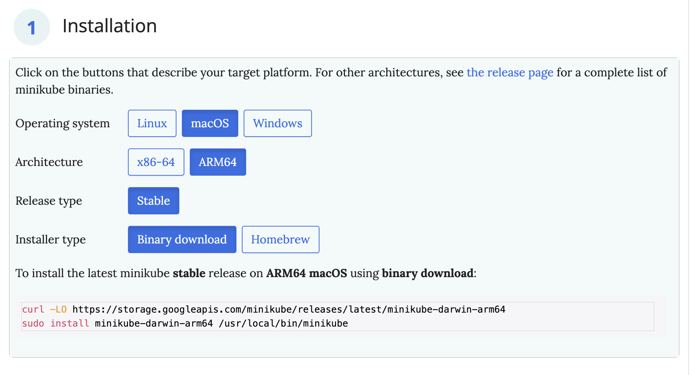

# Deploying MySQL and WordPress Using Kubernetes

Here's a step-by-step guide to installing Minikube using Docker Compose, creating a persistent volume and claim, setting up MySQL with secrets, and deploying WordPress. 

---

## Step 1: Install Minikube

- Go to https://minikube.sigs.k8s.io/docs/start/?arch=%2Fmacos%2Farm64%2Fstable%2Fbinary+download.
- Choose your Operating System, and you will see the commands to install the binary on your machine.



- Create your project directory:
```bash
mkdir mysql-wordpress-kubernetes
cd mysql-wordpress-kubernetes/
```

- Or, clone the code:
```bash
git clone https://github.com/Here2ServeU/mysql-wordpress-kubernetes/
cd mysql-wordpress-kubernetes/
```

- You should have a directory structure like this:
```text
.
├── README.md
├── images
│   └── minikube-binary-install.png
├── mysql
│   ├── mysql-deployment.yaml
│   ├── mysql-pvc.yaml
│   ├── mysql-secret.yaml
│   └── mysql-service.yaml
└── wordpress
    ├── wordpress-deployment.yaml
    ├── wordpress-pvc.yaml
    └── wordpress-service.yaml
```

## Step 2: Create My MySQL Deployment and Service
**Creating mysql-deployment.yaml**
```yaml
apiVersion: apps/v1
kind: Deployment
metadata:
  name: wordpress-mysql
  labels:
    app: wordpress
spec:
  selector:
    matchLabels:
      app: wordpress
      tier: mysql
  strategy:
    type: Recreate
  template:
    metadata:
      labels:
        app: wordpress
        tier: mysql
    spec:
      containers:
      - image: mysql:8.0
        name: mysql
        env:
        - name: MYSQL_ROOT_PASSWORD
          valueFrom:
            secretKeyRef:
              name: mysql-pass
              key: password
        - name: MYSQL_DATABASE
          value: wordpress
        - name: MYSQL_USER
          value: wordpress
        - name: MYSQL_PASSWORD
          valueFrom:
            secretKeyRef:
              name: mysql-pass
              key: password
        ports:
        - containerPort: 3306
          name: mysql
        volumeMounts:
        - name: mysql-persistent-storage
          mountPath: /var/lib/mysql
      volumes:
      - name: mysql-persistent-storage
        persistentVolumeClaim:
          claimName: mysql-pv-claim
```
**Creating mysql-service.yaml**
```yaml
apiVersion: v1
kind: Service
metadata:
  name: wordpress-mysql
  labels:
    app: wordpress
spec:
  ports:
    - port: 3306
  selector:
    app: wordpress
    tier: mysql
  clusterIP: None
```

## Step 3: Create MySQL Persistent Volume Claim
**Creating mysql-pvc.yaml**
```yaml
apiVersion: v1
kind: PersistentVolumeClaim
metadata:
  name: mysql-pv-claim
  labels:
    app: wordpress
spec:
  accessModes:
    - ReadWriteOnce
  resources:
    requests:
      storage: 20Gi
```

## Step 4: Create WordPress Deployment and Service
**Creating wordpress-deployment.yaml**
```yaml
apiVersion: apps/v1
kind: Deployment
metadata:
  name: wordpress
  labels:
    app: wordpress
spec:
  selector:
    matchLabels:
      app: wordpress
      tier: frontend
  strategy:
    type: Recreate
  template:
    metadata:
      labels:
        app: wordpress
        tier: frontend
    spec:
      containers:
      - image: wordpress:6.2.1-apache
        name: wordpress
        env:
        - name: WORDPRESS_DB_HOST
          value: wordpress-mysql
        - name: WORDPRESS_DB_PASSWORD
          valueFrom:
            secretKeyRef:
              name: mysql-pass
              key: password
        - name: WORDPRESS_DB_USER
          value: wordpress
        ports:
        - containerPort: 80
          name: wordpress
        volumeMounts:
        - name: wordpress-persistent-storage
          mountPath: /var/www/html
      volumes:
      - name: wordpress-persistent-storage
        persistentVolumeClaim:
          claimName: wp-pv-claim
```

**Creating wordpress-service.yaml**
```yaml
apiVersion: v1
kind: Service
metadata:
  name: wordpress
  labels:
    app: wordpress
spec:
  ports:
    - port: 80
  selector:
    app: wordpress
    tier: frontend
  type: LoadBalancer
```

## Step 5: Create WordPress Volume Claim
**Creating wordpress-pvc.yaml**
```yaml
apiVersion: v1
kind: PersistentVolumeClaim
metadata:
  name: wp-pv-claim
  labels:
    app: wordpress
spec:
  accessModes:
    - ReadWriteOnce
  resources:
    requests:
      storage: 20Gi
```

## Step 6: Create Secrets for MySQL Password

**Creating mysql-secret.yaml**
```yaml
apiVersion: v1
kind: Secret
metadata:
  name: mysql-pass
type: Opaque
data:
  password: cGFzc3dvcmQ=  # Base64 encoded value of 'password'
```

## Step 7: Apply the Configuration

**Apply the Secrets**
```bash
kubectl apply -f mysql/mysql-secret.yaml
```

**Create Persistent Volume Claims**
```bash
kubectl apply -f mysql/mysql-pvc.yaml
kubectl apply -f wordpress/wordpress-pvc.yaml
```

**Deploy MySQL**
```bash
kubectl apply -f mysql/mysql-deployment.yaml
kubectl apply -f mysql/mysql-service.yaml
```

**Deploy WordPress**
```bash
kubectl apply -f wordpress/wordpress-deployment.yaml
kubectl apply -f wordpress/wordpress-service.yaml
```

## Step 8: Test and Verify

**Check the Status of Pods and Services**
```bash
kubectl get pods
kubectl get svc
```

**Access WordPress**
- If using Minikube, get the Minikube IP: 
```bash
minikube service wordpress --url
```

- This command will return a URL (e.g., http://<minikube_ip>:<node_port>).
- You can use this URL to access WordPress in your browser.

---

## Clean Up

**Delete WordPress Deployment and Service:**
```bash
kubectl delete -f wordpress-deployment.yaml
kubectl delete -f wordpress-service.yaml
```

**Delete MySQL Deployment and Service:**
```bash
kubectl delete -f mysql-deployment.yaml
kubectl delete -f mysql-service.yaml
```

**Delete Persistent Volume Claims for WordPress and MySQL**
```bash
kubectl delete -f wordpress-pvc.yaml
kubectl delete -f mysql-pvc.yaml
```

**Delete MySQL Secret:**
```bash
kubectl delete -f mysql-secret.yaml
```

**Verify Cleanup**
```bash
kubectl get pods
kubectl get svc
kubectl get pvc
kubectl get pv
kubectl get secrets
```

**Cleanup Local Directories (Optional)**
```bash
sudo rm -rf /mnt/data/mysql
sudo rm -rf /mnt/data/wordpress
rm -rf /path/to/your/project/directory
```

**Stop and Delete Minikube (If Applicable) and Remove Minikube and Kubernetes configuration files**
```bash
minikube stop
minikube delete
rm -rf ~/.minikube
rm -rf ~/.kube
```

---

